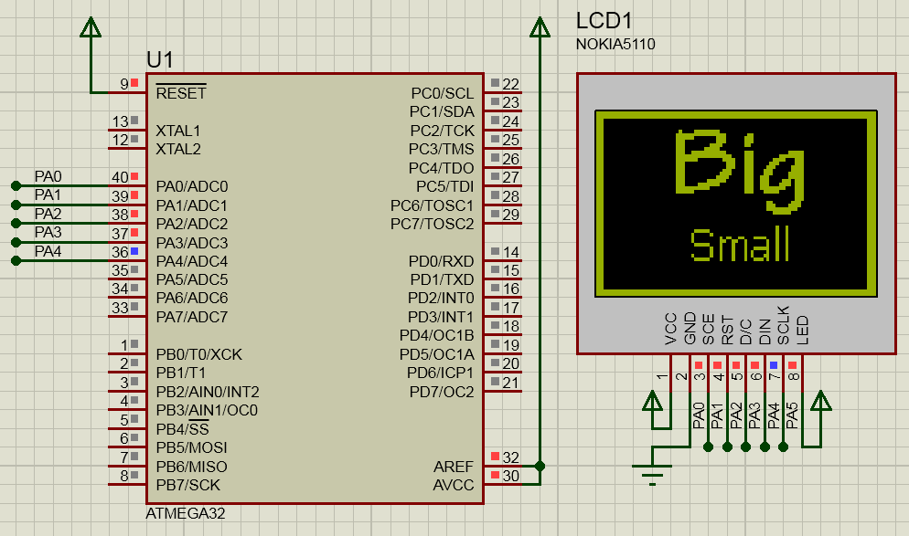

# avr-pcd8544

Graphical LCD driver for the PCD8544 (Nokia 5110, 84x48) on AVR microcontrollers.

[](https://github.com/efthymios-ks/avr-pcd8544/actions/workflows/ci.yml)



## Features
- Shared `glcd.c` drawing core (lines, rects, round rects, triangles, circles, bitmaps, text) with a 504-byte framebuffer.
- Pluggable fonts via the `glcd_font` struct; three bundled.
- Single-burst `glcd_render()` holds SCE low across the whole 504-byte transfer using horizontal auto-increment addressing.
- Optional hardware SPI (`PCD8544_USE_SPI`) when DIN/SCLK are on the AVR's MOSI/SCK; falls back to bit-bang otherwise.
- Runtime contrast via `pcd8544_set_contrast(vop)` instead of a hard-coded Vop.
- Builds clean at `-Wall -Wextra -Werror` on both `-Os` and `-O0`.
- Host-side Unity tests with fake AVR registers.

## Supported MCUs and toolchain
Verified on ATmega328P (default, DIP-28) and ATmega32.  
Toolchain is avr-gcc with `-std=gnu99`.

## Wiring (default demo, ATmega328P DIP-28)
8-pin Nokia 5110 breakout.  
The display runs on 3.3 V logic,  
so add level shifters (or series resistors with the on-board regulator pull-ups) when driving from a 5 V AVR;  
feeding 5 V directly into DIN/SCLK can damage the controller.

| Signal | Module pin | AVR pin   | DIP-28 | Config macro        | Description |
|--------|------------|-----------|--------|---------------------|-------------|
| RST    | 1          | PB0       | 14     | `PCD8544_PIN_RST`   | Reset (active low) |
| SCE    | 2          | PB2 (SS)  | 16     | `PCD8544_PIN_SCE`   | Chip enable (active low) |
| DC     | 3          | PB1       | 15     | `PCD8544_PIN_DC`    | Data / command select |
| DIN    | 4          | PB3 (MOSI)| 17     | `PCD8544_PIN_DIN`   | Serial data in |
| SCLK   | 5          | PB5 (SCK) | 19     | `PCD8544_PIN_SCLK`  | Serial clock |
| VCC    | 6          | +3.3 V    | —      | —                   | Logic + VLCD supply |
| LIGHT  | 7          | GND via 100-330 Ω | — | —              | Backlight cathode |
| GND    | 8          | GND       | 8      | —                   | Ground |

The default pins place DIN on MOSI (PB3) and SCLK on SCK (PB5),  
so defining `PCD8544_USE_SPI 1` drives the bus from the AVR's SPI peripheral instead of bit-banging.  
SCE stays on SS (PB2),  
which must remain an output in master mode.

The PCD8544 datasheet caps SCLK at 4 MHz.  
The bit-bang path compiles in a guard:  
`F_CPU > 20 MHz` without `PCD8544_USE_SPI` is a build error.  
Hardware SPI uses `F_CPU / 2` by default,  
which keeps you inside the spec at `F_CPU <= 8 MHz`.

## Quick start

```c
#include "pcd8544.h"
#include "glcd.h"
#include "fonts/font_5x8.h"

int main(void)
{
    // Bring up the panel and the shared framebuffer.
    pcd8544_init();
    glcd_clear();

    // Draw an outline around the full 84x48 viewport.
    glcd_draw_rect(0, 0, PCD8544_WIDTH, PCD8544_HEIGHT, GLCD_BLACK);

    // Print a label in the top-left corner using the 5x8 font.
    glcd_set_font(&font_5x8, GLCD_OVERWRITE);
    glcd_goto(2, 2);
    glcd_print_string("avr-pcd8544");

    // Push the framebuffer to the panel in one SCE-low burst.
    glcd_render();

    while (1) { }
}
```

## API

### pcd8544_init
- `void pcd8544_init(void)`
- Does: configures pins, pulses reset, runs the init sequence, applies the default contrast, and attaches the shared framebuffer to the glcd core.
- Notes: call once at startup before any `glcd_*` drawing calls.

### glcd_render
- `void glcd_render(void)`
- Does: pushes the shared framebuffer to the panel in a single SCE-low burst using the controller's horizontal auto-increment addressing.
- Notes: respects `glcd_set_inverted()` and preserves the glcd cursor.

### pcd8544_set_contrast
- `void pcd8544_set_contrast(uint8_t vop)`
- Does: writes the Vop register (bits 0..6; bit 7 is the command flag).
- Params: `vop` 0..127; values above 127 are clamped to 127.

### glcd_attach_buffer
- `void glcd_attach_buffer(uint8_t *buffer, uint8_t width_px, uint8_t height_px)`
- Does: attaches the chip-specific framebuffer to the shared drawing core.
- Params: `buffer` must be `width_px * height_px / 8` bytes and persist for the lifetime of the program.
- Notes: called once by `pcd8544_init()`; also usable by other chip layers.

### glcd_clear
- `void glcd_clear(void)`
- Does: zeros the framebuffer and moves the cursor to `(0, 0)`.

### glcd_clear_line
- `void glcd_clear_line(uint8_t row)`
- Does: zeros one 8-row page.

### glcd_fill_screen
- `void glcd_fill_screen(glcd_color color)`
- Does: fills the whole framebuffer with `GLCD_WHITE` or `GLCD_BLACK`.

### glcd_goto
- `void glcd_goto(uint8_t x, uint8_t y)`
- Does: moves the cursor to the given pixel coordinate.
- Notes: both axes are clamped against the attached panel size.

### glcd_goto_line
- `void glcd_goto_line(uint8_t row)`
- Does: moves the cursor to the start of the given 8-row page.

### glcd_get_x
- `uint8_t glcd_get_x(void)`
- Does: returns the cached cursor X coordinate.
- Returns: current pixel X.

### glcd_get_y
- `uint8_t glcd_get_y(void)`
- Does: returns the cached cursor Y coordinate.
- Returns: current pixel Y.

### glcd_get_line
- `uint8_t glcd_get_line(void)`
- Does: returns the cached cursor page row.
- Returns: current 8-row page index.

### glcd_set_pixel
- `void glcd_set_pixel(uint8_t x, uint8_t y, glcd_color color)`
- Does: sets a single pixel in the framebuffer.
- Notes: out-of-bounds writes are silently dropped; the cursor is not touched.

### glcd_draw_line
- `void glcd_draw_line(uint8_t x0, uint8_t y0, uint8_t x1, uint8_t y1, glcd_color color)`
- Does: draws a Bresenham line between the two endpoints.

### glcd_draw_rect
- `void glcd_draw_rect(uint8_t x, uint8_t y, uint8_t width, uint8_t height, glcd_color color)`
- Does: draws a rectangle outline anchored at `(x, y)`.

### glcd_draw_round_rect
- `void glcd_draw_round_rect(uint8_t x, uint8_t y, uint8_t width, uint8_t height, uint8_t radius, glcd_color color)`
- Does: draws a rounded-rectangle outline.

### glcd_draw_triangle
- `void glcd_draw_triangle(uint8_t x0, uint8_t y0, uint8_t x1, uint8_t y1, uint8_t x2, uint8_t y2, glcd_color color)`
- Does: draws a triangle outline through the three given vertices.

### glcd_draw_circle
- `void glcd_draw_circle(uint8_t cx, uint8_t cy, uint8_t radius, glcd_color color)`
- Does: draws a Bresenham mid-point circle centred on `(cx, cy)`.

### glcd_draw_bitmap
- `void glcd_draw_bitmap(uint8_t x, uint8_t y, uint8_t width, uint8_t height, const uint8_t *bitmap_pgm, glcd_color color)`
- Does: blits a column-major PROGMEM bitmap at `(x, y)`.

### glcd_fill_rect
- `void glcd_fill_rect(uint8_t x, uint8_t y, uint8_t width, uint8_t height, glcd_color color)`
- Does: fills a rectangle using an 8-pixel column-mask fast path.

### glcd_fill_round_rect
- `void glcd_fill_round_rect(uint8_t x, uint8_t y, uint8_t width, uint8_t height, uint8_t radius, glcd_color color)`
- Does: fills a rounded rectangle.

### glcd_fill_triangle
- `void glcd_fill_triangle(uint8_t x0, uint8_t y0, uint8_t x1, uint8_t y1, uint8_t x2, uint8_t y2, glcd_color color)`
- Does: fills a triangle using an integer scanline algorithm.
- Notes: handles horizontal edges without divide-by-zero; no libm dependency.

### glcd_fill_circle
- `void glcd_fill_circle(uint8_t cx, uint8_t cy, uint8_t radius, glcd_color color)`
- Does: fills a circle using horizontal scanlines.

### glcd_set_inverted
- `void glcd_set_inverted(bool inverted)`
- Does: flips the global render-inversion flag.
- Notes: the framebuffer is left untouched; `glcd_render()` pushes the bitwise complement when the flag is set.

### glcd_is_inverted
- `bool glcd_is_inverted(void)`
- Does: returns the cached render-inversion flag.
- Returns: `true` when inversion is active.

### glcd_invert_rect
- `void glcd_invert_rect(uint8_t x, uint8_t y, uint8_t width, uint8_t height)`
- Does: inverts the pixels inside the rectangle in-place in the framebuffer.

### glcd_set_font
- `void glcd_set_font(const glcd_font *font, glcd_text_mode mode)`
- Does: selects the current font and the glyph blending mode.
- Params: `mode` is `GLCD_OVERWRITE` (clear background) or `GLCD_MERGE` (OR-blend into existing contents).

### glcd_get_char_width
- `uint8_t glcd_get_char_width(char c)`
- Does: returns the rendered width of one glyph in the current font.
- Returns: width in pixels, or `0` when the glyph is outside the font range.

### glcd_get_string_width
- `uint8_t glcd_get_string_width(const char *s)`
- Does: returns the total pixel width of a RAM string in the current font.

### glcd_get_string_width_p
- `uint8_t glcd_get_string_width_p(const char *s_pgm)`
- Does: returns the total pixel width of a PROGMEM string in the current font.

### glcd_print_char
- `void glcd_print_char(char c)`
- Does: draws one glyph at the cursor and advances the cursor by the glyph width plus one trailing column.

### glcd_print_string
- `void glcd_print_string(const char *s)`
- Does: draws a RAM-resident string one glyph at a time.

### glcd_print_string_p
- `void glcd_print_string_p(const char *s_pgm)`
- Does: draws a PROGMEM-resident string one glyph at a time.

### glcd_print_int
- `void glcd_print_int(int32_t value)`
- Does: formats and draws a signed 32-bit integer.
- Notes: handles `INT32_MIN` correctly via `ltoa`.

### glcd_print_float
- `void glcd_print_float(float value, uint8_t decimals)`
- Does: formats and draws a fixed-decimal float.
- Notes: uses integer scaling, round-half-to-even, and zero-padded decimals; no libm dependency.

### glcd_color
- `typedef enum { GLCD_WHITE = 0, GLCD_BLACK = 1 } glcd_color`
- Does: 1-bit pixel color used across the drawing core.
- Notes: `GLCD_BLACK` is "pixel on" (ink), `GLCD_WHITE` is "pixel off", regardless of panel electrical polarity.

### glcd_text_mode
- `typedef enum { GLCD_OVERWRITE = 0, GLCD_MERGE = 1 } glcd_text_mode`
- Does: blending mode for text and bitmap draws.
- Notes: `GLCD_OVERWRITE` clears background pixels first; `GLCD_MERGE` OR-blends into the existing buffer.

### glcd_font
- `typedef struct { const uint8_t *data; uint8_t width; uint8_t height; uint8_t first; uint8_t count; } glcd_font`
- Does: font descriptor with glyph bytes in PROGMEM.
- Notes: layout matches the mikroC X-GLCD exporter — one width byte followed by `width * ceil(height / 8)` column bytes per glyph; `first` is the ASCII code of the first glyph (usually `0x20`).

### Fonts bundled
- `font_5x8` — compact proportional 5x8 default.
- `font_tahoma_11x13` — Tahoma 11x13 proportional.
- `font_tekton_pro_ext_27x28` — Tekton Pro Ext 27x28 display face.

## Configuration

### PCD8544_WIDTH
- `#define PCD8544_WIDTH 84`
- Does: panel column count in pixels.

### PCD8544_HEIGHT
- `#define PCD8544_HEIGHT 48`
- Does: panel row count in pixels.

### PCD8544_PIN_RST
- `#define PCD8544_PIN_RST B, 0`
- Does: port/bit pair for the active-low RST pin.

### PCD8544_PIN_DC
- `#define PCD8544_PIN_DC B, 1`
- Does: port/bit pair for the data/command select pin.

### PCD8544_PIN_SCE
- `#define PCD8544_PIN_SCE B, 2`
- Does: port/bit pair for the active-low chip-enable pin.
- Notes: shared with hardware-SPI SS (PB2) on ATmega328P and must stay an output in master mode.

### PCD8544_PIN_DIN
- `#define PCD8544_PIN_DIN B, 3`
- Does: port/bit pair for serial data in.

### PCD8544_PIN_SCLK
- `#define PCD8544_PIN_SCLK B, 5`
- Does: port/bit pair for serial clock.

### PCD8544_USE_SPI
- `#define PCD8544_USE_SPI 0`
- Does: selects between hardware SPI (`1`) and bit-bang (`0`).
- Notes: only valid when `PCD8544_PIN_DIN` and `PCD8544_PIN_SCLK` match the AVR's MOSI/SCK.

### PCD8544_DEFAULT_CONTRAST
- `#define PCD8544_DEFAULT_CONTRAST 60u`
- Does: Vop value applied by `pcd8544_init()`.
- Notes: 0..127; 60 is a typical mid-point for 3.3 V Nokia 5110 breakouts.

## Memory usage
Before/after comparison on ATmega32 (v1's historical target).

| Build | Flash / RAM |
|-------|------------:|
| v1 (ATmega32, -Os) | 15228 B / 515 B |
| v2 (ATmega32, -Os) | 3746 B / 522 B |

## Build, test, simulate

```powershell
.\Build.ps1
.\Build.ps1 -AllMcus -DebugBuild
.\Build.ps1 -Test
.\Simulate.ps1
.\Simulate.ps1 -NoLaunch
```

`Build.ps1` auto-installs the AVR toolchain (and host gcc for `-Test`) into a per-user cache on first run.  
`-RemoveTools` removes only what the script installed;  
`-NoInstall` fails loudly instead of downloading.  
`Simulate.ps1` runs the SimulIDE visual demo on Windows.

## Limitations
- No read-back from the display. All drawing goes through the shared framebuffer.
- Partial-screen updates are not exposed; `glcd_render()` always pushes the whole 504-byte buffer.
- Hardware SPI mode shares SS (PB2) with SCE; other SPI peripherals on the same bus need their own CS and will contend with the display's SCE strobe.

## Changelog and license
See [CHANGELOG.md](CHANGELOG.md).  
MIT — see [LICENSE](LICENSE).
